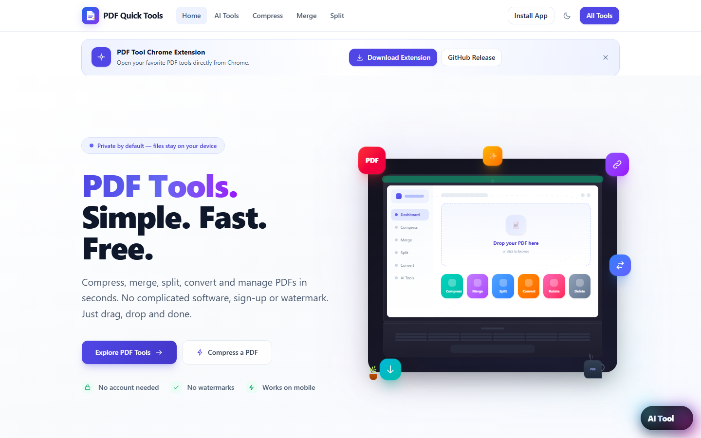
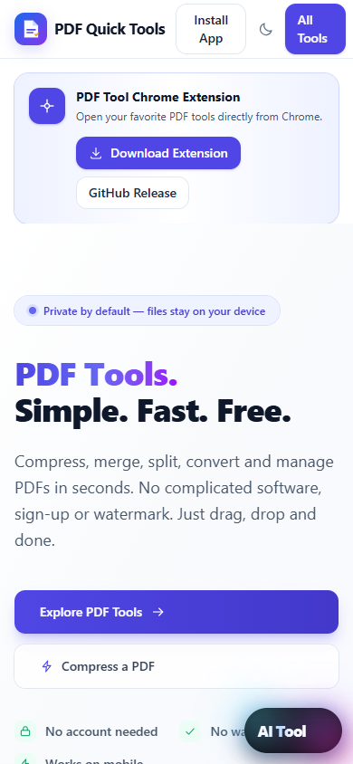
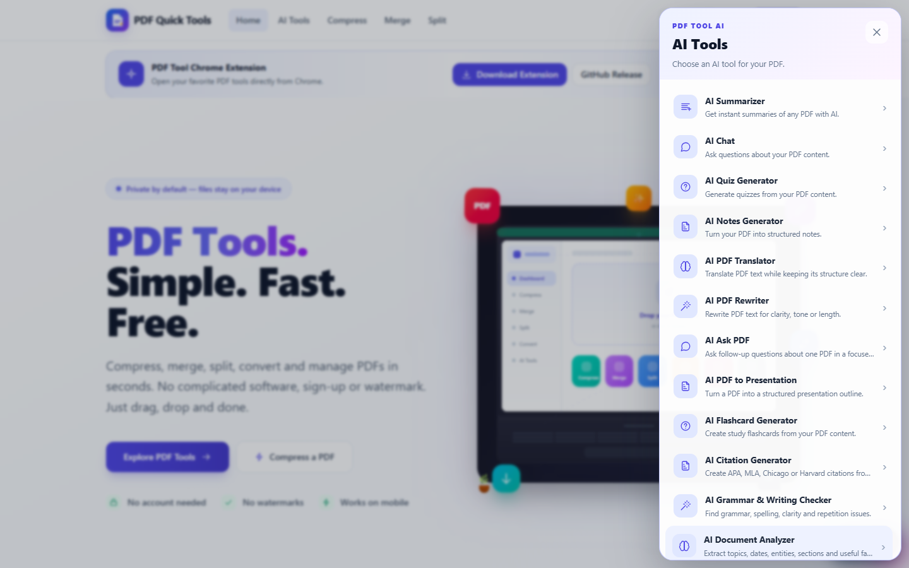

# PDF Quick Tools

<p align="center">
  <strong>Simple PDF tools. Fast results. Privacy-first processing.</strong>
</p>

<p align="center">
  <a href="https://pd-f-tool.vercel.app/">Open the live website</a>
  ·
  <a href="https://pd-f-tool.vercel.app/tools">Browse all tools</a>
  ·
  <a href="https://github.com/jutthamid148-svg/PDF-Tools/releases/tag/v1.0.0">Chrome Extension release</a>
</p>

PDF Quick Tools is a browser-based PDF workspace for compressing, merging, splitting, converting, editing, organizing, and understanding documents with AI.

> **Live:** [pd-f-tool.vercel.app](https://pd-f-tool.vercel.app/)

## Screenshots

### Homepage



### Mobile experience



### AI tools drawer



## What It Includes

### PDF tools

- Compress PDF
- Merge PDF
- Split PDF
- PDF to JPG
- JPG to PDF
- Rotate PDF
- Rearrange PDF pages
- Delete pages
- Extract pages
- Add page numbers
- Watermark PDF
- Sign PDF

### AI tools

- AI Summarizer
- AI Chat
- AI Quiz Generator
- AI Notes Generator
- AI PDF Translator
- AI PDF Rewriter
- AI Ask PDF
- AI PDF to Presentation
- AI Flashcard Generator
- AI Citation Generator
- AI Grammar & Writing Checker
- AI Document Analyzer
- AI Resume Analyzer
- AI PDF Question Generator

Every AI tool uses the same document workflow: browser-side PDF text extraction, an explicit AI action, progress/error states, and structured results. AI output is presented as assistance, not professional, legal, academic, financial, or hiring advice.

## Privacy By Design

- Regular PDF operations run in the browser.
- Original PDFs are not uploaded for regular tools.
- AI tools send extracted text to the server-side AI endpoint only when the user runs an AI action.
- Analytics are optional and gated behind the privacy choice banner.
- No PDF files, document text, passwords, or API keys are stored in browser preferences.
- No account is required.

Read the full policies:

- [Privacy Policy](https://pd-f-tool.vercel.app/privacy)
- [Terms of Use](https://pd-f-tool.vercel.app/terms)
- [Disclaimer](https://pd-f-tool.vercel.app/disclaimer)
- [About Muhammad Hamid](https://pd-f-tool.vercel.app/about)
- [Contact](https://pd-f-tool.vercel.app/contact)

## Chrome Extension

The companion Manifest V3 extension provides quick access to PDF tools from Chrome, including search, favorites, recent tools, themes, current PDF detection, context-menu actions, and the `Ctrl + Shift + P` shortcut.

### Download

- [Download the Chrome Extension ZIP](https://pd-f-tool.vercel.app/downloads/pdf-tool-chrome-extension.zip)
- [GitHub Release v1.0.0](https://github.com/jutthamid148-svg/PDF-Tools/releases/tag/v1.0.0)

### Install locally

1. Download and extract the ZIP.
2. Open `chrome://extensions`.
3. Enable **Developer mode**.
4. Click **Load unpacked**.
5. Select the extracted extension folder.

For Chrome Web Store publishing, upload the ZIP through the Chrome Developer Dashboard. Chrome does not allow websites to silently install extensions.

## Technology

- React 19
- TanStack Router and TanStack Start
- TypeScript
- Vite
- Tailwind CSS v4
- `pdf-lib`
- `pdfjs-dist`
- Gemini API through a server-side endpoint
- Vercel deployment

## Local Development

### Requirements

- Node.js 18 or newer
- npm
- A Gemini API key for AI features

### Setup

```bash
git clone https://github.com/jutthamid148-svg/PDF-Tools.git
cd PDF-Tools
npm install
```

Create `.env.local`:

```env
GEMINI_API_KEY=your_gemini_api_key_here
```

Start the development server:

```bash
npm run dev
```

Open [http://localhost:3000](http://localhost:3000).

### Validation and builds

```bash
npm run typecheck
npm run build
npm run build:extension
```

The Chrome extension build is written to `dist-extension/` and can be loaded unpacked in Chrome.

## Project Structure

```text
src/
├── components/       Shared UI, uploaders, feedback, AI panels, and layout
├── hooks/            Shared processing state machines
├── lib/              PDF, AI, analytics, SEO, site, and tool services
├── routes/           Website pages and individual tool routes
└── server/           Server-side Gemini integration

api/                  Vercel server endpoint for AI requests
extension/            Manifest V3 Chrome extension source
public/               PWA assets, icons, sitemap, and screenshots
scripts/              Asset generation scripts
```

## Deployment

The production website is deployed at [pd-f-tool.vercel.app](https://pd-f-tool.vercel.app/).

The repository includes the PWA manifest, service worker, PNG install icons, extension build configuration, and GitHub release package.

## Maintainer

PDF Quick Tools is built and maintained by **Muhammad Hamid** from **Faisalabad, Pakistan**.

Contact: [jutthamid148@gmail.com](mailto:jutthamid148@gmail.com)

## License

This project is available under the MIT License.
